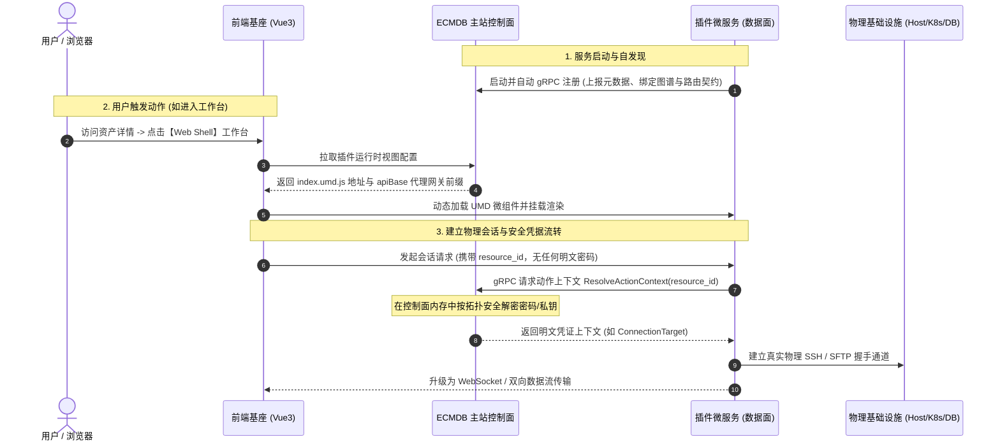

# ECMDB Plugins (`ecmdb-plugins`)

`ecmdb-plugins` 是 ECMDB（企业级下一代元数据驱动配置管理数据库）的官方微服务插件生态仓库。项目采用 **Mono-repo** 架构，将各个业务插件以独立微服务形式进行开发、解耦与部署。

## 一、核心架构与交互时序

系统严格遵循 **控制面 (Control Plane) 与数据面 (Data Plane) 分离** 的微服务架构设计：

* **主站控制面 (ECMDB Core)**：托管资产元数据 Schema、数据拓扑图谱、加密凭据存储；在内存中按权限安全解密；提供网关代理与插件服务发现控制面。
* **插件数据面 (Plugin Service)**：承载实际的底层连接握手与具体运维业务（如 Web Shell 终端流、SFTP 文件双向读写、容器日志监控等），并托管配套的前端 UMD 微组件。



---

## 二、核心设计机制

### 1. 凭证零泄露与内存解密
* **绝不暴露给前端**：主机密码、私钥、Token 等敏感数据绝不通过 HTTP API 流向浏览器；
* **按需内存流转**：前端仅传递资产 ID，插件微服务在建立物理连接时，通过内部 gRPC 接口安全请求主站；主站控制面在内存中解密凭据后投递给插件后端，使用完毕即在内存中释放。

### 2. 微前端热插拔 (UMD 架构)
* 主站前端提供通用的微前端加载基座；
* 插件前端打包为标准 UMD 单包（`index.umd.js` + `index.css`），由插件后端静态托管；
* 主站基座运行时动态拉取微组件，并统一注入 Vue 3、Element Plus、Pinia 等共享依赖，插件迭代无需重新编译或发版主站。

### 3. 网关透明反向代理
* 前端微组件发起的 API 请求均以 `apiBase`（即 `/api/cmdb/plugin-runtime/:plugin_id`）为前缀；
* 主站插件网关拦截并自动剥离前缀，根据注册的 `upstream` 代理转发至插件后端物理端口，实现内外网安全隔离与统一鉴权。

---

## 三、两类插件模型

在规划和编写插件前，根据业务场景选择对应的模型：

| 插件形态 | 核心特点 | 典型场景 | API 范式 |
| :--- | :--- | :--- | :--- |
| **资产驱动型 (Target-Driven)** | **最常用**。绑定 CMDB 具体资产模型（或复合拓扑），自动在资产详情页挂载动作，并将安全解密后的资产注入业务处理上下文。 | SSH 终端、SFTP、Redis 管理器、数据库管控台、K8s 控制台 | `plugin.Target[T](reg, modelUID).Model("名称", "分组").Workspace(...)` |
| **纯动作型 (Pure Actions)** | 无资产绑定。作为系统级全局功能入口或批量扫描工具。 | 网络连通性检测、集群通用巡检 | `reg.Action("ping", "Ping").Definition()` |

---

## 四、开发文档

关于插件的具体实现与设计规范，请查阅以下文档：

- **[插件开发指南](docs/plugin-guide.md)**：包含单资产插件、复合拓扑插件及前端微组件的完整代码骨架，以及 Tag 语法速查表。
- **[运行时设计规范](docs/runtime-design.md)**：说明微前端 UMD 加载机制、网关反向代理与路由重写规则。
- **[权限契约规范](docs/permissions.md)**：说明声明式权限点定义与 EIAM 契约同步机制。

---

## 五、仓库目录结构

本项目是一个 Mono-repo 结构，所有插件共享同一个 Go Module (`github.com/Duke1616/ecmdb-plugins`)：

```text
.
├── api/                        # gRPC Protobuf 接口定义（包含主站与插件的通信协议）
├── docs/                       # 架构设计文档与实战开发指南
│   ├── permissions.md          # 权限契约规范
│   ├── plugin-guide.md         # 插件开发实战指南与代码模板
│   └── runtime-design.md       # 运行时与网关反代设计规范
├── ioc/                        # 全局共享依赖注入组件
├── pkg/                        # 基础通用工具包（bootstrap 脚手架、共享 gRPC resolver 等）
├── plugins/                    # 业务插件微服务集合
│   └── ssh/                    # SSH 终端与文件管理插件
│       ├── cmd/                # 插件服务启动入口
│       ├── config/             # 本地配置文件模板
│       ├── frontend/           # 插件配套前端微组件 (Vue3 / TS / Vite UMD)
│       └── internal/           # 插件后端领域逻辑（定义、Web 接口、业务核心）
└── Taskfile.yaml               # 本地开发与代码生成任务管理
```

---

## 六、本地开发与常用命令

项目使用 [Taskfile.yaml](Taskfile.yaml) 统一管理构建、测试与生成流程：

```bash
# 1. 整理与更新依赖
go mod tidy

# 2. 编译并更新 gRPC Proto 契约代码
task gen

# 3. 运行全量单元测试 (规范表驱动测试，保证 100% 通过)
go test -v ./...

# 4. 本地启动示例 SSH 插件微服务
task run
```

也可以直接通过命令行参数启动指定插件：
```bash
go run ./plugins/ssh/cmd/main.go server \n    --addr :18080 \n    --upstream http://127.0.0.1:18080 \n    --ecmdb-grpc-addr 127.0.0.1:9000
```

---

## 七、插件生态矩阵

| 插件名称 | 插件唯一标识 (`UID`) | 业务描述 | 当前状态 | 对应代码目录 |
| :--- | :--- | :--- | :---: | :--- |
| **SSH 终端插件** | `builtin.ssh` | 基于主机和跳板机网关链路，提供 Web Shell 在线终端与 SFTP 可视化文件管理。 | ✅ 已完成 | [plugins/ssh](plugins/ssh) |
| **K8s 管控插件** | `builtin.k8s` | 提供 Kubernetes 容器 Exec 终端登录、实时日志流查看与双向文件传输。 | ⏳ 规划中 | - |
| **Redis 管理器** | `builtin.redis` | 提供在线 Key 浏览、慢查询分析与交互式命令行控制台。 | ⏳ 规划中 | - |
