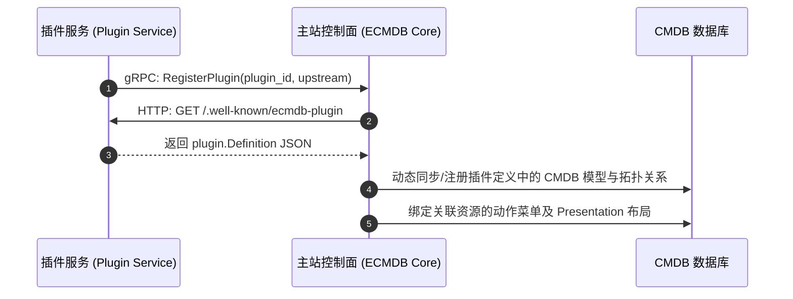
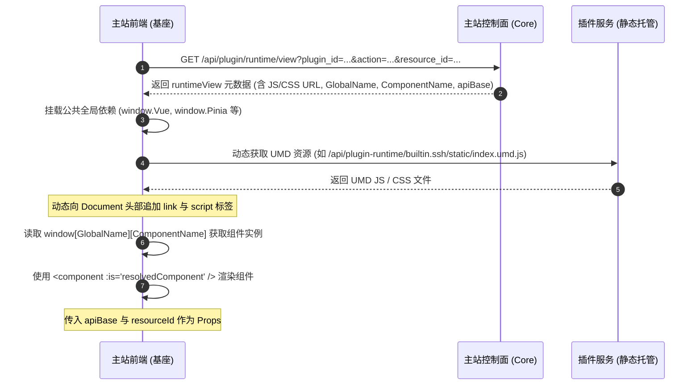
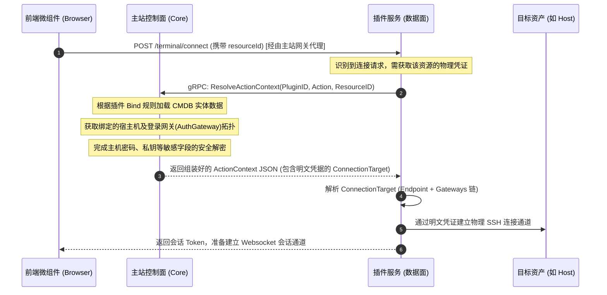

# ECMDB 插件运行时设计规范

本文档定义 ECMDB 插件系统的核心架构、角色职责、网络代理机制、微前端动态加载规范以及安全凭证投递机制。

---

## 架构总览

ECMDB 插件系统采用 **控制面与数据面分离** 的设计：
* **主站 (ECMDB Core)** 充当**控制面**，集中管理元数据模型、资产数据、权限、凭证解密以及统一代理路由。
* **插件服务 (Plugin Service)** 充当**数据面**，作为独立的微服务部署，负责具体的业务逻辑执行（如 SSH 连接会话管理、SFTP 读写、容器日志拉取等），并以 UMD 格式提供配套前端组件。

---

## 核心角色与职责

### 1. 主站控制面 (ECMDB Core)
* **数据托管**：负责配置管理数据库（CMDB）的模型、属性、关系拓扑以及实例数据托管。
* **凭证解密**：统一托管并加密存储主机的连接凭证（如密码、私钥、跳板机凭证）。仅在插件通过 gRPC 请求解析上下文时，由主站控制面在内存中解密并投递，避免明文凭证落盘或流向浏览器。
* **反向代理网关**：暴露统一路由 `/api/plugin-runtime/:plugin_id/*any`，提取 `plugin_id` 查询其物理 `upstream`，向插件服务透明代理转发 HTTP / WebSocket 流量。
* **运行时视图生成**：提供 `GET /api/plugin/runtime/view` 接口，根据插件定义和动作关系，为前端生成微前端加载元数据（包括加载路径、挂载组件名、API 前缀和预注入属性）。

### 2. 插件服务数据面 (Plugin Service)
* **能力声明**：暴露统一的 `GET /.well-known/ecmdb-plugin` 自描述接口，输出包含模型定义（Setup）、资源动作（Action）以及输入上下文绑定规则（Bind）的 `plugin.Definition`。
* **静态资源托管**：托管独立编译出的前端 UMD 资源目录，将其挂载在静态路由下（通常为 `/static`），提供 `index.umd.js` 和 `index.css`。
* **业务逻辑执行**：提供业务 API，通过主站 gRPC 通道反向获取并解析明文凭证，建立底层的资源会话。

### 3. 微前端组件 (Plugin Frontend)
* **微组件打包 (UMD)**：插件前端以 UMD 库格式打包。为保证轻量化和版本兼容，将 `vue`、`vue-router`、`pinia`、`element-plus` 等公共基座依赖声明为外部化依赖（External），打包时不包含其源码。
* **无状态动态挂载**：前端通过全局挂载对象（如 `window.EcmdbPluginBuiltinSsh`）导出入口组件 `Index`，不自行处理敏感凭据，仅消费主站注入的运行参数（如 `apiBase` 和 `resourceId`）。
* **约定式入口命名**：主站当前根据 `plugin_id` 推导 UMD 全局挂载名，规则为 `EcmdbPlugin` + `plugin_id` 按 `.`、`-` 分段后的 PascalCase。例如 `builtin.ssh` 对应 `EcmdbPluginBuiltinSsh`，`builtin.k8s-exec` 对应 `EcmdbPluginBuiltinK8sExec`。

---

## 核心交互机制与时序

### 1. 声明式注册与模型同步
插件服务启动时向主站主动发起注册，主站通过 HTTP 反向拉取其自描述定义，并在主站 CMDB 中动态构建模型、建立关联拓扑和绑定动作菜单。

### 2. 微前端 UMD 动态加载与渲染
当用户在主站界面触发插件 Action 时，主站前端通过解析运行时视图，在浏览器沙箱内动态下载、注入并渲染插件前端微组件。

新增插件无需调整主站前端代码的前提是插件遵守运行时视图协议：
* UMD 构建产物必须输出为 `/static/index.umd.js`，样式输出为 `/static/index.css`。
* Vite/Rollup 的 UMD `name` 必须与主站返回的 `entry.global_name` 一致。
* UMD 导出对象必须包含 `entry.component_name` 指定的入口组件；当前主站固定为 `Index`。
* 插件前端只能通过运行时注入的 `apiBase` 访问自身后端接口，不能写死物理 upstream。
* 插件使用的共享依赖应与主站基座提供的全局依赖名称一致，例如 `Vue`、`Pinia`、`ElementPlus`。

### 3. 反向代理与路径重写
主站提供透明的反向代理网关。前端微组件调用的所有接口均以 `apiBase`（即 `/api/cmdb/plugin-runtime/:plugin_id`）为前缀发送给主站，主站将其透明转发给插件的物理地址，并去掉网关路由前缀。

* **转发规则**：前端发送请求至 `/api/cmdb/plugin-runtime/{plugin_id}/{path}`，主站代理网关自动剥离前缀，并向插件的物理 `upstream` 转发请求，实际请求 Path 变为 `/{path}`。
* **实例**：主站前端加载 UMD 文件的请求为 `/api/cmdb/plugin-runtime/builtin.ssh/static/index.umd.js`，主站网关代理转发至 SSH 插件的 `upstream` 物理地址，重写后的 Path 为 `/static/index.umd.js`，正好命中插件后端的 `server.Static("/static", "./plugins/ssh/frontend/dist")` 路由。

### 4. 凭证解密与内部上下文投递 (gRPC)
为了确保凭证安全，密码和私钥等敏感字段绝不下发给浏览器。插件后端在接收到连接请求时，通过内部 gRPC 向主站按需拉取解密后的明文凭证。

---

## 权限控制设计

1. **统一认证**：主站插件网关在代理请求时，保留并透传用户的 `Authorization`、Cookie 等鉴权请求头。
2. **细粒度鉴权**：插件服务后端可以接入自身的 EIAM 中间件，提取透传的权限头，执行业务接口级的细粒度权限判定（如控制是否允许执行文件上传/下载）。
3. **网络安全隔离**：插件服务应部署于主站可达的内网环境，物理接口无需也不得暴露给公网。
