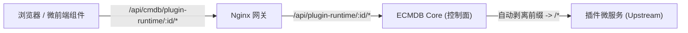
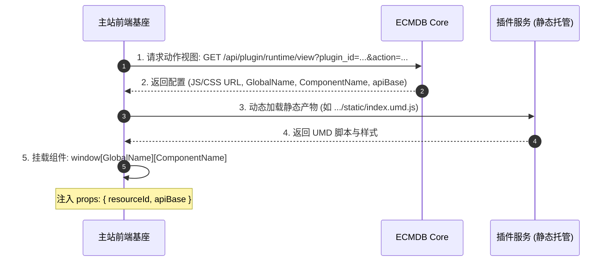
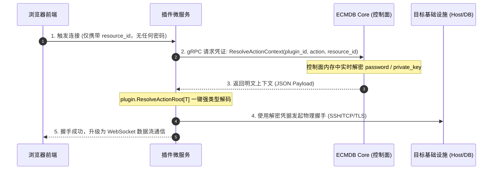

# ECMDB 插件运行时与网关设计规范

> 本文用极简的图表与规则清单，说明插件在 **网络转发**、**微前端加载** 和 **凭据安全流转** 三个核心链路中的运行机制。

---

## 一、双层网络代理（请求如何到达插件）

插件微服务无需暴露公网，由主站控制面提供统一反向代理：

```mermaid
flowchart LR
    Browser["浏览器 / 微前端组件"] -->|"/api/cmdb/plugin-runtime/:id/*"| Nginx["Nginx 网关"]
    Nginx -->|"/api/plugin-runtime/:id/*"| Core["ECMDB Core (控制面)"]
    Core -->|"自动剥离前缀 -> /*"| Plugin["插件微服务 (Upstream)"]
```

### 路由转换对照表

| 请求来源 | 请求路径 | 核心处理 |
| :--- | :--- | :--- |
| **浏览器前端** | `/api/cmdb/plugin-runtime/builtin.ssh/static/index.umd.js` | 访问统一入口（配置 1 小时长超时，关闭缓冲） |
| **Nginx 网关** | `/api/plugin-runtime/builtin.ssh/static/index.umd.js` | 剥离业务域前缀 `/cmdb`，转发至 Core |
| **插件微服务** | `/static/index.umd.js` | Core 剥离网关前缀，透明转发至插件后端物理端口 |

> **开发铁律**：插件前端调用自身后端接口时，**必须**使用主站注入的 `props.apiBase` 作为前缀，严禁写死物理地址。

---

## 二、微前端热插拔（前端如何动态加载）

主站前端通过动态追加标签加载 UMD 微组件，插件发版无需重启或重新编译主站。

```mermaid
sequenceDiagram
    autonumber
    participant UI as 主站前端基座
    participant Core as ECMDB Core
    participant Plugin as 插件服务 (静态托管)

    UI->>Core: 1. 请求动作视图: GET /api/plugin/runtime/view?plugin_id=...&action=...
    Core-->>UI: 2. 返回配置 (JS/CSS URL, GlobalName, ComponentName, apiBase)
    UI->>Plugin: 3. 动态加载静态产物 (如 .../static/index.umd.js)
    Plugin-->>UI: 4. 返回 UMD 脚本与样式
    UI->>UI: 5. 挂载组件: window[GlobalName][ComponentName]
    Note over UI: 注入 props: { resourceId, apiBase }
```

### 前端微组件 4 项核心约定

| 规范项 | 约定值 / 规则 | 说明 |
| :--- | :--- | :--- |
| **构建格式** | `umd` | 输出至 `dist/index.umd.js` 与 `dist/index.css` |
| **公共依赖** | `external` | `vue`、`element-plus`、`pinia` 由主站基座统一注入，禁止打包进插件 |
| **全局挂载名** | `EcmdbPlugin` + PascalCase | 规则：去除插件 ID 中的 `.` 与 `-` 并转大驼峰。如 `builtin.ssh` -> `EcmdbPluginBuiltinSsh` |
| **入口组件名** | 固定为 `Index` | 入口文件必须导出 `export { Index }` |

---

## 三、凭证安全流转（密码私钥如何解密）

> **核心原则**：**敏感凭证绝不下发给浏览器**。密码与私钥仅在后端建立物理连接的一瞬间在内存中定向解密流转。

```mermaid
sequenceDiagram
    autonumber
    participant UI as 浏览器前端
    participant P as 插件微服务
    participant Core as ECMDB Core (控制面)
    participant Target as 目标基础设施 (Host/DB)

    UI->>P: 1. 触发连接 (仅携带 resource_id，无任何密码)
    P->>Core: 2. gRPC 请求凭证: ResolveActionContext(plugin_id, action, resource_id)
    Note over Core: 控制面内存中实时解密 password / private_key
    Core-->>P: 3. 返回明文上下文 (JSON Payload)
    Note over P: plugin.ResolveActionRoot[T] 一键强类型解码
    P->>Target: 4. 使用解密凭据发起物理握手 (SSH/TCP/TLS)
    P-->>UI: 5. 握手成功，升级为 WebSocket 数据流通信
```

### 凭据安全三要素
1. **静态高强度加密**：存储在 CMDB 中的密码、私钥、Token 默认全部加密存储；
2. **瞬态内存流转**：解密仅发生在 Core 控制面内存中，并经由内部内网 gRPC 通道直接投递给插件后端，不落盘；
3. **极简消费**：插件后端直接调用 `plugin.ResolveActionRoot[T]`，一行代码自动反序列化为泛型结构体。

---

## 四、安全与隔离规范

* **认证透传**：主站网关透明透传客户端 `Authorization` 与 Cookie 凭证；
* **权限校验**：插件接口若需受控，使用 EIAM 强类型权限点进行拦截；
* **内网部署**：插件微服务仅面向内网主站开放端口，公网不可直连。
